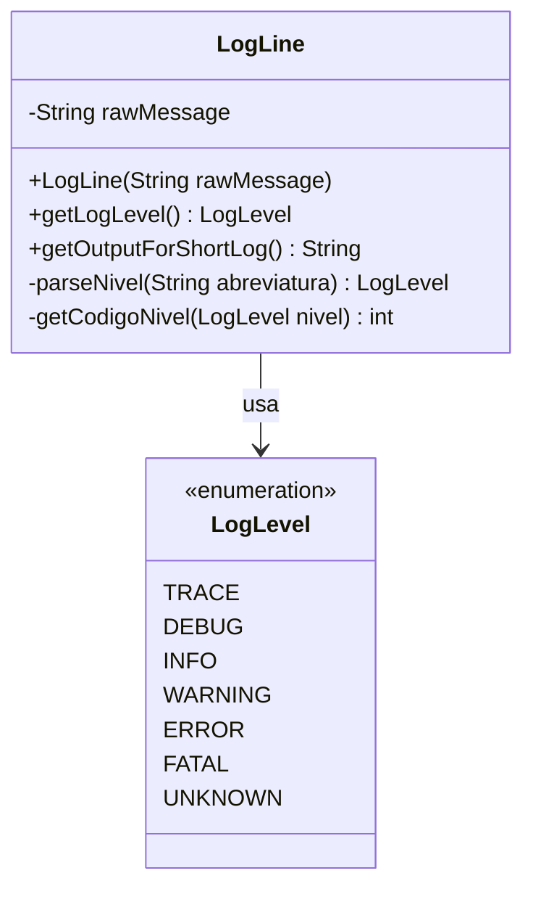
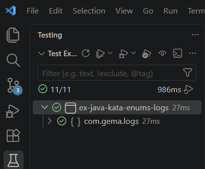
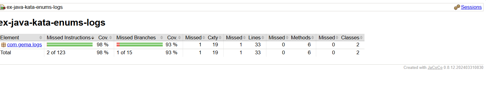

# Logs, Logs, Logs

Ejercicio del Java Track de [Exercism](https://exercism.org/) centrado en el uso de **enums** en Java, aplicados al parseo y transformación de líneas de log.

## Índice

- [Descripción](#descripción)
- [Diagrama de clases](#diagrama-de-clases)
- [Instalación](#instalación)
- [Testing y coverage](#testing-y-coverage)
- [Autora](#autora)

## Descripción

El ejercicio consiste en procesar líneas de log con el formato `"[<NIVEL>]: <MENSAJE>"` y resolver tres tareas:

1. **Parsear el nivel de log**: definir un enum `LogLevel` con los niveles `TRACE`, `DEBUG`, `INFO`, `WARNING`, `ERROR` y `FATAL`, e implementar `LogLine.getLogLevel()` para obtener el nivel a partir de la abreviatura del log (`TRC`, `DBG`, `INF`, `WRN`, `ERR`, `FTL`).
2. **Soportar niveles desconocidos**: añadir el elemento `UNKNOWN` al enum, devuelto cuando la abreviatura no coincide con ninguna conocida.
3. **Convertir a formato corto**: implementar `LogLine.getOutputForShortLog()`, que transforma la línea de log a un formato reducido `"<CÓDIGO>:<MENSAJE>"`, mapeando cada nivel a un código numérico (`UNKNOWN=0`, `TRACE=1`, `DEBUG=2`, `INFO=4`, `WARNING=5`, `ERROR=6`, `FATAL=42`).

## Diagrama de clases

## Instalación

1. Clona el repositorio:

git clone https://github.com/gmp395/ex-java-kata-enums-logs.git

2. Entra en la carpeta del proyecto:

cd ex-java-kata-enums-logs

3. Compila el proyecto con Maven:

mvn clean install

## Testing y coverage

Se ha utilizado la suite de tests oficial del ejercicio en Exercism (`LogsLogsLogsTest`), con 15 tests implementados con JUnit 5 y AssertJ, que cubren las tres tareas: parseo de cada nivel de log, manejo de niveles desconocidos (`UNKNOWN`) y conversión al formato corto.

Todos los tests pasan correctamente, como se ve en la siguiente captura del panel Testing de VS Code:

La cobertura de código, medida con JaCoCo, es del 98% de instrucciones y 93% de ramas:

## Autora

**Gema Miguel**
[GitHub](https://github.com/gmp395)